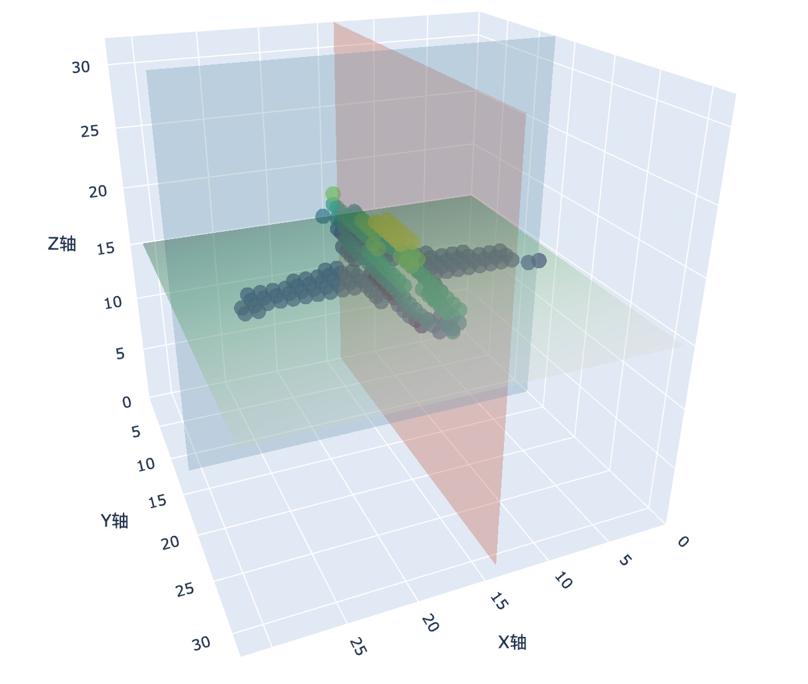
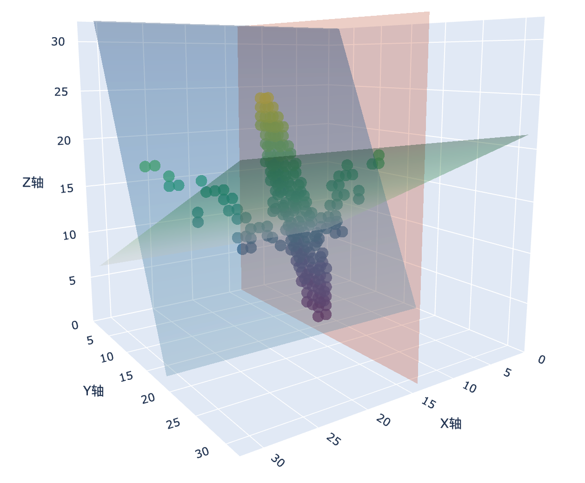
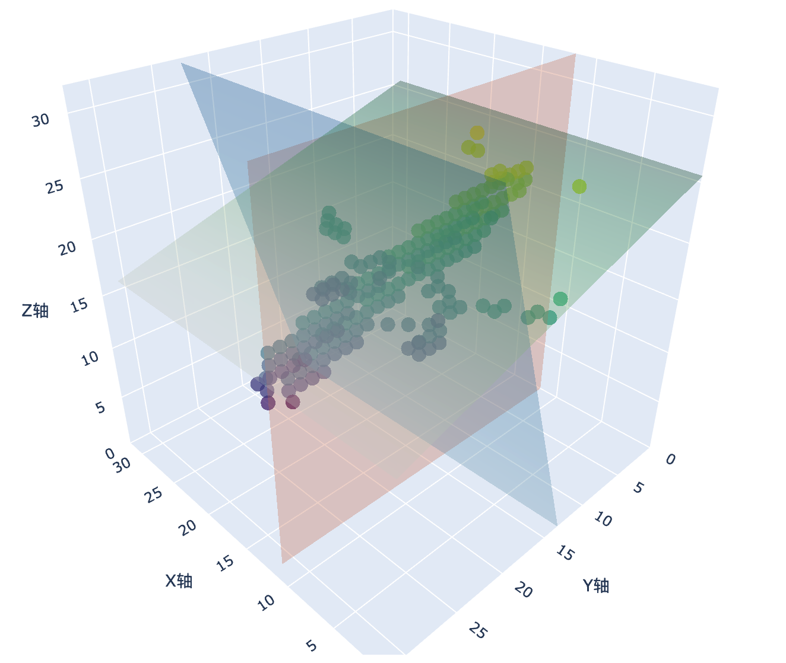

# PRSNet Re-implementation

A PyTorch re-implementation of **PRS-Net: Planar Reflective Symmetry Detection Net for 3D Models**

[](https://arxiv.org/abs/1910.06511)
[](https://www.python.org/)
[](https://pytorch.org/)

## Overview


该项目是对 PRS-Net 的一个简洁、简化版本的复现。PRS-Net 是一个用于检测三维体素模型中平面反射对称性的深度学习模型。该网络以 $ 32 *32 * 32$ 体素网格为输入，通过一个三维卷积神经网络编码器和后续的全连接层来预测对称平面的参数。

为了简化实现，部分原论文中的实现细节和训练配置已被修改或省略。由于仅仅在ShapeNet非常小的子集上训练，该项目没有预测物体的旋转轴。

该项目全部在cpu上完成，这使得代码更易于理解和用于复现。


This project is a clean and simplified re-implementation of PRS-Net, a deep learning model designed to detect planar reflective symmetry in 3D voxelized models. The network takes a $32 *32 *32$ voxel grid as input and predicts the parameters of symmetry planes using a 3D CNN encoder followed by fully connected layers.

To simplify the implementation, some details and training configurations from the original paper have been modified or omitted. Additionally, since the model is trained only on a very small subset of ShapeNet, it does not predict the object's rotational axis.

The entire project runs on CPU, making the code easier to understand and suitable for research or educational purposes.

## Features

- 🔥 **Clean PyTorch Implementation**: Modern, readable code structure
- 🚀 **Easy Training Pipeline**: Streamlined training and inference scripts
- 📊 **Built-in Visualization**: Integrated plotting and 3D visualization tools
- 🎯 **Flexible Architecture**: Easily configurable model parameters
- 📱 **Interactive Interface**: Gradio-based web interface for demonstrations

## Results

<div align="center">

### Example 1: Airplane Symmetry Detection


### Example 2: Airplane Symmetry Detection


### Example 3: Airplane Symmetry Detection


</div>

## Architecture

The PRSNet model consists of:
- **3D CNN Encoder**: 5-layer 3D convolutional network (1→4→8→16→32→64 channels)
- **Dual FC Heads**: Two separate fully connected branches for symmetry plane prediction
- **Input**: 32×32×32 voxel grid
- **Output**: Symmetry plane parameters (normal vector + point on plane)

## Installation

### Prerequisites
- Python 3.8+
- CUDA (optional, for GPU acceleration)

### Setup Environment

```bash
# Clone the repository
git clone <your-repo-url>
cd PRSNet_Re-implementation

# Create virtual environment (recommended)
python -m venv prsnet_env
source prsnet_env/bin/activate  # On Windows: prsnet_env\Scripts\activate

# Install dependencies
pip install -r requirements.txt
```

## Dataset Structure

The project expects data in the following format:

```
toy_data/
└── shapenet_plane/
    └── [model_id]/
        ├── images/
        ├── models/
        │   ├── model_normalized.obj
        │   ├── model_normalized.solid.binvox
        │   └── model_normalized.surface.binvox
        └── screenshots/
```

## Usage

### Training

```bash
python train.py
```

**Training Configuration:**
- Default batch size: 1
- Learning rate: 1e-3 with ReduceLROnPlateau scheduler
- Device: Auto-detection (CUDA/MPS/CPU)
- Checkpoints saved every 10 epochs

### Inference

```bash
python inference.py
```

**Inference Features:**
- Loads pre-trained model from `ckpts/`
- Visualizes symmetry plane predictions
- Generates interactive 3D plots
- Saves results to `inference_outputs/`

### Visualization Tools

The project includes several visualization utilities in the `viewer/` directory:

- `shapenet_voxel_viewer.py` - Basic voxel visualization
- `shapenet_augmented_voxel_viewer.py` - Enhanced voxel display
- `shapnet_mesh_viewer.py` - 3D mesh visualization
- `binvox_rw.py` - Binvox file I/O utilities


## File Structure

```
PRSNet_Re-implementation/
├── 📜 README.md                    # This file
├── 🔧 requirements.txt             # Dependencies
├── 🚀 train.py                     # Training script
├── 🔍 inference.py                 # Inference script
├── 📁 models/
│   └── prsnet.py                   # PRSNet model definition
├── 📁 datasets/
│   └── data_loader.py              # Dataset and data loading utilities
├── 📁 viewer/                      # Visualization tools
├── 📁 assets/                      # Example images and results
├── 📁 ckpts/                       # Model checkpoints
└── 📁 toy_data/                    # Sample dataset
```


## Citation

If you use this implementation in your research, please cite the original paper:

```bibtex
@article{prsnet2019,
  title={PRS-Net: Planar Reflective Symmetry Detection Net for 3D Models},
  author={[Authors]},
  journal={arXiv preprint arXiv:1910.06511},
  year={2019}
}
```

## License

This project is for research and educational purposes. Please refer to the original paper for licensing terms.

